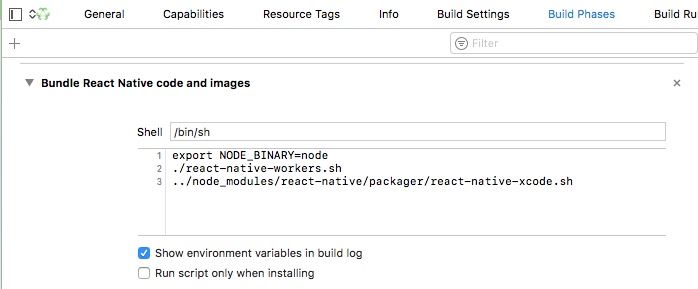

# patch to support RN0.41.2
----------------------
- installation:
```
cp ./node_modules/react-native-workers/ios/react-native-workers.sh ./ios/

```
- then update  'Build Phases -> Bundle React Native code and images' with:
```
export NODE_BINARY=node
./react-native-workers.sh
../node_modules/react-native/packager/react-native-xcode.sh
```

# Patched to bundle /workers/*Worker.js for RN0.35.0
--------------------------------
- with changes according to:
-- [patch for React Native 0.35.0](https://github.com/drudge/react-native-workers)
-- [patch to bundle workers on iOS](https://github.com/devfd/react-native-workers/issues/21)

- [Original README](./README-orig.md)
